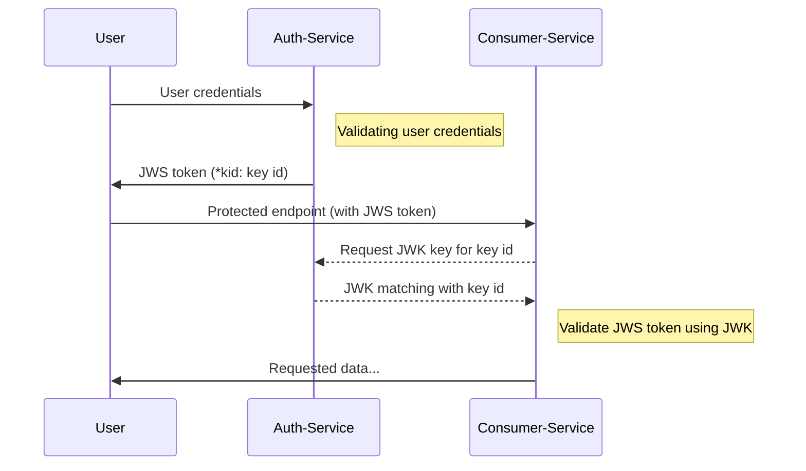

JSON Web Tokens are popular mechanism to use as bearer tokens for client authorizations, signed JWT tokens called JSON Web Signatures (JWS) using for this purpose. Authorization servers issue a valid JWS token when user authentication is successful. Mechanism is work on the basis of assumption that only the authentication service is capable of creating a valid JWS token. JWS are designed to be tamper proof, so third parties cannot amend the token. Clients forward JWS tokens as a bearer token for all the other microservices / service endpoints as an authorization credential to gain access to protected resources.

There are many best practices to ensure JWS are tamper proof. Using symmetric algorithms to sign JWS are discouraged since it is a relatively easy algorithm to break and retrieve the hashing key. Both signing party and validation party using the same key so if that key breached, anyone can create valid JWS according to their needs.

## Composition of JWK

**JSON Web Key (JWK)** is a standardized format for representing cryptographic keys in JSON format. It is defined in the JSON Web Key (JWK) specification, which is a part of the larger JSON Web Token (JWT) family of specifications. JWKs are used to securely represent and transmit cryptographic keys, making them suitable for various security-related applications, including JWTs, digital signatures, and encryption.

A JWK typically includes key parameters such as the key type (RSA, ECDSA, Octet key, etc.), key usage (signing, encryption), and the actual key material. These parameters are represented as JSON key-value pairs.

You can refer this [RunKit for sample implementation](https://runkit.com/lilanga/64f7d2feeed87a00081776a2) of JWK key pair for RSA keys to get an idea of JWK structure.

JWKs are JSON based representation of these keys while PEM and DER formats are alternative binary based representation of those keys.

**PEM (Privacy Enhanced Mail)**: An older format used for representing cryptographic keys, often seen in X.509 certificates and other security-related contexts.

**DER (Distinguished Encoding Rules)**: A binary format used for encoding data structures like keys and certificates. It's more compact but less human-readable compared to JSON.

## Advantage of using JSON Web Keys (JWK) for JWS validations


So asynchronous algorithms like RSA (Rivest-Shamir-Adleman) algorithm or EC (Elliptic Curve) are encouraged to use for JWS token signing and verification. Authorization servers use private key of the key pair to sign the token while all the other services using publicly available public key to verify the signed token.

To make the system impregnable, Authorization servers need to rotate keypairs periodically. This is a challenging operation as all the other parties need to sync with new public keys. JSON Web Key (JWK, often called JWKS - JSON Web Key Sets) provide a reliable mechanism to address this challenge effectively.

JWKs are cryptographic key representation using JSON data formats. They are like Privacy Enhanced Mail format (PEM) but being a JSON representation of cryptographic keys enable them to share them via web services. This feature is used by authorization servers to distribute their public keys to needful verification parties.

### Following are the key benefits of using JWKs

1. **Interoperability**: JWK provides a standardized way to represent keys in various JSON-based systems, ensuring better interoperability across different platforms and languages.

2. **Security**: By following standardized formats and practices, the likelihood of making security-related mistakes when handling keys is reduced.

3. **Key Rotation**: JWKs can be easily rotated, allowing for better security practices by regularly changing keys without causing major disruptions.

4. **Compactness**: JWKs are represented in JSON, which is a lightweight and human-readable format, making them easy to transmit using web-based service and store.

## Using JWKs to sign JWS and sharing verification keys to third parties

Let's go through an example of how JSON Web Keys (JWKs) are used to authenticate and verify JSON Web Signatures (JWS).

In this example, we'll use NodeJS and libraries called `node-jose` and `jsonwebtoken` to demonstrate the process. `jsonwebtoken` is a widely used library for working with JWTs, `node-jose` is a popular library with JWK workflows as it provides well-crafted helper utilities for the related operations.

> Full source code for [the demo solution is available at this GitHub repo](https://github.com/Lilanga/jwk-for-jwt).
{: .prompt-tip }

We are creating two services. The **auth service** is responsible for authentication and authorization related operations. The **consumer service** is having protected endpoints and validate JWS tokens and authorize users to protected endpoints.



### Creating Auth service

Auth service is responsible for authentication of users by validating credentials and issuing JWS token with correct access controls (claims). Auth server also expose JWKS endpoint for validation parties to retrieve latest keys. If they do not have a key with specific key ID in their keys cache, they will call this endpoint for key retrieval.

For the demo purpose, here we are using in memory sqlite3 database for user data store.

Initialize npm project inside an empty folder and Install dependencies.

```bash
npm init

npm install express body-parser node-jose sqlite3
```

Create index.js file with following logic to create a simple authorization server with authentication and JWKS endpoint.

```javascript
const express = require('express')
const jose = require('node-jose')
const sqlite3 = require('sqlite3')
const bodyparser = require('body-parser')
const crypto = require('crypto')

const db = new sqlite3.Database(':memory:')
const app = express()
const port = process.env.JWKPORT

app.use(bodyparser.json())
app.use(bodyparser.urlencoded({ extended: false }))
let signingKey = null

// Using in memory database for demo purposes
db.serialize(() => {
  db.run(`CREATE TABLE users (
    ID INTEGER PRIMARY KEY AUTOINCREMENT,
    userName VARCHAR(50) NOT NULL,
    password VARCHAR(50) NOT NULL,
    role VARCHAR(5) NOT NULL
    );`)

  const insertStatement = db.prepare('INSERT INTO users (userName, password, role) VALUES (?, ?, ?)')
  insertStatement.run('John', 'testpass', 'read')
  insertStatement.run('Jane', 'pass123', 'write')
  insertStatement.finalize()
})

// generate key pair on demand
const createKeysForSigning = async () => {
  const keyStore = jose.JWK.createKeyStore()

  const props = {
    use: 'sig', alg: 'RS256'
  }

  const createdKey = await keyStore.generate('RSA', 2048, props)
  return createdKey
}

// Create signing key pairs at the start, this can be configured to run periodically to rotate keys and store them secured cache with TTL
(async () => {
  signingKey = await createKeysForSigning()
})().catch(e => {
  console.log(`error occured while generating signing key: ${e}`)
})

// Generate JWT token with given claims
const generateJWT = async (claims, signKey) => {
  console.log(signKey)
  const jwt = await jose.JWS.createSign({ alg: 'RS256', format: 'compact' }, signKey).update(JSON.stringify(claims), 'utf8').final()
  return jwt
}

// Check database for user
const getUser = async (userName, password) => {
  return new Promise((resolve, reject) => {
    const sql = 'SELECT ID, role FROM users WHERE userName = ? AND password = ?'

    db.get(sql, [userName, password], (err, user) => {
      if (err) {
        reject(err)
      }
      if (!user) {
        reject(new Error('User not found'))
      }

      resolve(user)
    })
  })
}

// Authentication endpoint
app.post('/api/v1/auth', async (req, res) => {
  const { userName, password } = req.body
  console.log(req.body)
  let user = null
  try {
    user = await getUser(userName, password)
  } catch (err) {
    return res.status(401).json({ message: 'credentials not correct' })
  }
  const dt = new Date()
  const iat = Math.floor((dt.getTime() / 1000))
  const exp = Math.floor(new Date(dt.getTime() + (20 * 60 * 1000)) / 1000)
  const sessionId = crypto.randomUUID()
  const jti = crypto.randomUUID()

  const claims = {
    sessionId,
    role: user.role,
    exp,
    iat,
    nbf: iat,
    jti
  }

  const signedJWT = await generateJWT(claims, signingKey)

  res.json({ jwt: signedJWT })
})

// JWKS Signing key exchange endpoint
app.get('/.well-known/jwks.json', async (req, res) => {
  const jwks = {
    keys: [signingKey]
  }

  res.json(jwks)
})

app.listen(port, () => {
  console.log(`Authorisation service running on PORT ${port}`)
})
```

Auth Service expect `JWKPORT`environment variable to be set when it is running. Lets set it to `JWKPORT=3001`

In this example, the server exposes a single endpoint, `/.well-known/jwks.json`, which returns a JSON object containing the JWK.

Remember that this example is simplified and doesn't cover the complexities of real-world JWK management and security practices.

We can use following API call to get a JWS token when service up and running.

```bash
curl --location 'http://localhost:3001/api/v1/auth' \
--header 'Content-Type: application/json' \
--data '{
   "userName":"Jane",
   "password":"pass123"
}'
```

Following is the exposed JWKS endpoint by the auth service.

```bash
curl --location 'http://localhost:3001/.well-known/jwks.json'
```

### Creating consumer service

Consumer service is responsible for authorizing users to protected endpoints. For that, service is validating user's JWS token and grant access based on claims if token is legit. This service calls Auth service to get JWKs for token signature validation. We are using `jwks-rsa`library to handle this key retrieval operations.

Initialize npm project inside an empty folder and install following dependencies.

```bash
npm init

npm install express jsonwebtoken jwks-rsa
```

Create index.js file with following logic to have a simple resource service with JWS validation using auth server JWKS endpoint.

```bash
const express = require('express')
const jwt = require('jsonwebtoken')
const jwksClient = require('jwks-rsa')

const app = express()
const PORT = process.env.PORT

// Create a JWKS client to fetch JWKs from a remote URL
const jwksClientInstance = jwksClient({
  jwksUri: process.env.JWKS_SERVER
})

// Middleware to authenticate incoming requests
const authenticateJWT = (req, res, next) => {
  const token = req.header('Authorization')

  if (!token) {
    return res.status(401).json({ message: 'Authorization token is missing' })
  }

  // Verify the JWT token using JWK from authenticate server
  jwt.verify(token, getKey, (err, decoded) => {
    if (err) {
      return res.status(403).json({ message: 'Token verfication is failed' })
    }

    req.user = decoded
    next()
  })
}

// Get the correct key for JWT verification
const getKey = (header, callback) => {
  jwksClientInstance.getSigningKey(header.kid, (err, key) => {
    if (err) {
      return callback(err)
    }

    if (!key) {
      return callback(new Error('Invalid token'), null)
    }

    const signingKey = key.publicKey || key.rsaPublicKey

    callback(null, signingKey)
  })
}

app.get('/api/v1/protected', authenticateJWT, (req, res) => {
  res.json({ message: 'Authenticate and authorised to access the endpoint', user: req.user })
})

app.listen(PORT, () => {
  console.log(`Server is running on port ${PORT}`)
})
```

In this example, the server uses a JWKS client to fetch JWKs from a specified URL (often provided by an authentication provider like Auth0).

The authenticateJWT middleware reads the token from the Authorization header, verifies it using the JWKs, and attaches the decoded user information to the request object before passing it to the protected route.

This setup demonstrates how JWKs are used to verify JWTs, ensuring that only valid and authenticated users can access protected routes.

Service is expecting following environment variables to be set.

```bash
JWKS_SERVER=https://localhost:3001/.well-known/jwks.json
PORT=3000
```

When both of the services up and running locally, we can call our resource service with JWS retrieved from auth server.

```bash
curl --location 'localhost:3000/api/v1/protected' \
--header 'Authorization: <JWT TOKEN FROM PREVIOUS CALL>'
```
